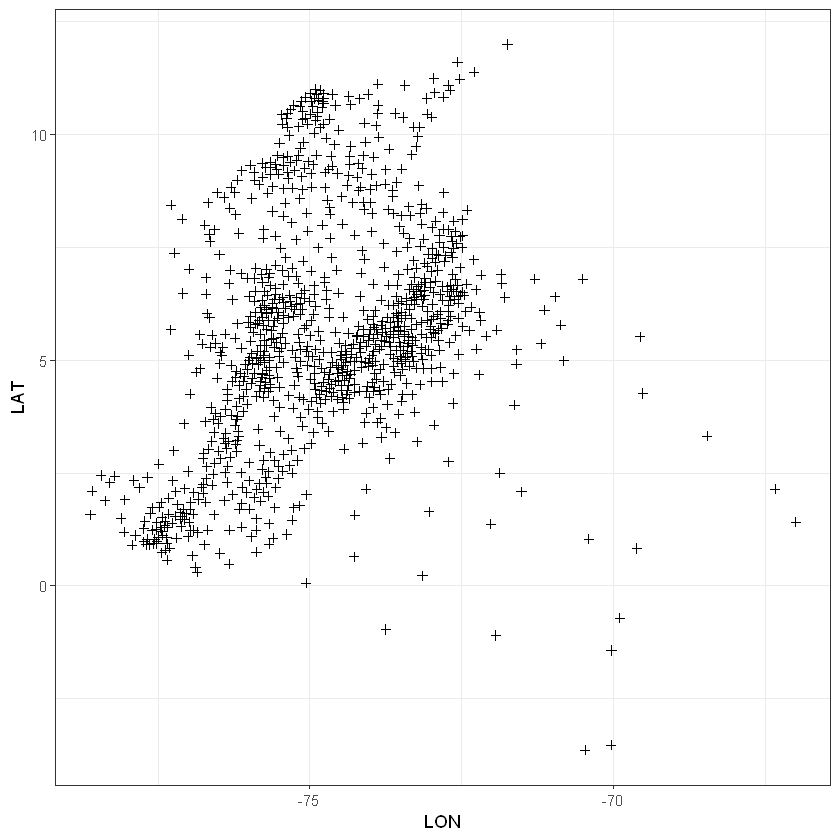

# Visualización de Datos Espaciales (Introducción)

En el tratamiento de datos espaciales un aspecto importante es la visualización de los mismos. Existen múltiples programas que incorporan elementos para su análisis pero muy pocos que se integran correctamente con los Sistemas de Información Geográfica (_GIS_ por su nombre en inglés).

En este módulo haremos un ejercicio práctico para algunos de los elementos básicos de visualización mediante programación en R y, posteriormente, emplearemos otros elementos de visualización. Siempre basándonos en uso de software libre y código abierto.

## Censo Nacional Agropecuario (análisis de caso)

En el siguiente enlace: https://www.dropbox.com/sh/mktsl3f5iehnvf8/AACOjUSss8sVTcHgH6s2twiSa?dl=0 se puede acceder a las tablas que contienen los resultados del Tercer Censo Nacional Agropecuario (2014).

Otra opción es acceder directamente a la descarga de las tablas a través del enlace http://www.dane.gov.co/index.php/estadisticas-por-tema/agropecuario/censo-nacional-agropecuario-2014

Las tablas que se aprecian son:


|Archivo|Descripción|Casos|Variables|
|--- |---        |  ---|      ---|
|S01_15(Unidad_productora)|Contiene la identificación de las Unidades Productoras Agropecuaria_ UPA y Unidades Productoras No Agropecuaria_ UPNA, el tipo de territorialidad (Resguardo indígena y tierras de las comunidades negras), Uso del suelo, naturaleza jurídica, área de la UPA y uso agropecuario, y predominancia de tenencia.|0|379|
|S06A(Cultivos)|Corresponde al inventario y prácticas agrícolas y pecuaria en la UPA y descripción básica de cultivos acuícolas. asi como la sustentabilidad de la actividad agropecuaria, tanto en la gestión sobre recursos naturales como la gestión para la producción.|0|23|
|S06BD(Frutales_y_forestales_dispersos,_y_viveros)|Contiene los frutales y forestales dispersos por especie, la cantidad de pencas, arbustos o árboles existentes en la UPA que no están sembrados en un lote compacto o no tienen una distancia de siembra regular. Para los viveros agrícolas y forestales, el registro corresponde a las especies y la cantidad de plántulas.|0|11|
|S07D(Acuicultura)|La actividad acuícola corresponde a la orientación (alevinaje, carne, ciclo completo y ornamentales) y las especies que han sido cultivadas en la UPA en los últimos 12 meses. Igualmente número de cosechas y producción.|0|13|
|S08(Pesca_artesanal)|Corresponde a actividades de Pesca ARTESANAL: Sitio de realización, periodo, tipo de arte para pescar, embarcación, especies captCorresponde a actividades de Pesca ARTESANAL: Sitio de realización, periodo, tipo de arte para pescar, embarcación, especies capturadas y volumen de especies capturadas y finalidad de la pesca.uradas y volumen de especies capturadas y finalidad de la pesca.|0|19|
|S09(Maquinaria_uso_agropecuario)|Contiene el inventario de maquinaria clasificada de acuerdo con dos rangos de antigüedad: menor a cinco años y de cinco o más años.|0|11|
|S10(Construcciones_uso_agropecuario)|Contiene las construcciones para uso agropecuario y se registra el área que ocupa en metros cuadrados.|0|10|
|S14(Actividad_no_agropecuaria)|Contiene información sobre las actividades no agropecuarias desarrolladas en la UPA o UPNA: Las cuales se clasifican en servicios de apoyo a las actividades agropecuarias, transformación de materias primas agropecuarias, comercio, servicios, minería con títulos, minería sin títulos y gas, generación y transmisión de energía, así como actividades de defensa nacional, orden público y actividades de seguridad.|0|79|
|S15H(Hogares)|Contiene el número de Hogares al interior de cada vivienda y percepción de pobreza subjetiva y desplazamiento dirigida al jefe del hogar o su cónyuge.|0|21|
|S15P(Personas)|Contiene el registro de todas las personas residentes habituales del hogar, captando información básica sobre cada uno de sus miembros: parentesco, sexo, edad, autorreconocimiento étnico, sitio o persona con quien permanecen los niños menores de cinco años, alfabetismo, asistencia educativa, nivel de escolaridad y afiliación a salud.|0|24|
|S15V(Viviendas)|Contiene el número de viviendas existentes en la UPA, condición de ocupación de la vivienda y tenencia de servcios públicos y condición de materiales predominante de la vivienda.|0|16|

El primer paso, antes de cualquier otra cosa, es importar los datos. Previamente, las tablas fueron preparadas en el archivo `CensoAgro.RData` (incluido en el enlace) para su manejo en el programa; en todo caso, el procedimiento de importación es el siguiente:


```R
# library(readr)
#
#
# Cultivos <- read_csv("S06A(Cultivos).csv")
# Frutales <- read_csv("S06BD(Frutales_y_forestales_dispersos,_y_viveros).csv")
# Acuicultura <- read_csv("S07D(Acuicultura).csv")
# Pesca_artesanal <- read_csv("S08(Pesca_artesanal).csv")
# Maquinaria <- read_csv("S09(Maquinaria_uso_agropecuario).csv")
# Construcciones <- read_csv("S10(Construcciones_uso_agropecuario).csv")
# Act_no_agro <- read_csv("S14(Actividad_no_agropecuaria).csv")
# Hogares <- read_csv("S15H(Hogares).csv")
# Personas <- read_csv("S15P(Personas).csv")
# Viviendas <- read_csv("S15V(Viviendas).csv")
```

Los datos importados traen algunas características heradadas:

`[1] "tbl_df"     "tbl"        "data.frame"`

Se requiere convertirlos en `data.frame`; el código para ello es:


```R
# Cultivos<-as.data.frame(Cultivos)
# Frutales<-as.data.frame(Frutales)
# Acuicultura<-as.data.frame(Acuicultura)
# Pesca_artesanal<-as.data.frame(Pesca_artesanal)
# Maquinaria<-as.data.frame(Maquinaria)
# Construcciones<-as.data.frame(Construcciones)
# Act_no_agro<-as.data.frame(Act_no_agro)
# Hogares<-as.data.frame(Hogares)
# Personas<-as.data.frame(Personas)
# Viviendas<-as.data.frame(Viviendas)
```

Y, para salvar todo lo importado:


```R
# save(list = ls(all = TRUE), file = 'CensoAgro.RData')
```

Como los datos han sido preparados, vamos a proceder a cargarlos desde el archivo antes mencionado:


```R
load('CensoAgro.RData')
```

Por cuestiones de capacidad de memoria RAM en el laboratorio vamos a procesar sólo los datos relacionados con **Acuicultura**. Una de las variables contenidas en el `data.frame` es la producción total (en kilogramos) de la planta. La etiqueta de la variables es `P_S7P100`. Veamos el encabezado de los datos:


```R
head(Acuicultura)
```


<table>
<thead><tr><th scope=col>TIPO_REG</th><th scope=col>PAIS</th><th scope=col>P_DEPTO</th><th scope=col>P_MUNIC</th><th scope=col>UC_UO</th><th scope=col>ENCUESTA</th><th scope=col>COD_VEREDA</th><th scope=col>P_S7PNUMPEZ</th><th scope=col>P_S7P96</th><th scope=col>P_S7P97</th><th scope=col>P_S7P98</th><th scope=col>P_S7P99</th><th scope=col>P_S7P100</th></tr></thead>
<tbody>
	<tr><td>7        </td><td>170      </td><td>05       </td><td>05001    </td><td>00020001 </td><td>000447973</td><td>05001006 </td><td>1        </td><td>41190100 </td><td> 2       </td><td> 200     </td><td>2.5      </td><td> 1.00    </td></tr>
	<tr><td>7        </td><td>170      </td><td>05       </td><td>05001    </td><td>00156152 </td><td>000158786</td><td>05001040 </td><td>1        </td><td>41190200 </td><td> 1       </td><td>1200     </td><td>6.5      </td><td> 7.80    </td></tr>
	<tr><td>7        </td><td>170      </td><td>05       </td><td>05001    </td><td>00200001 </td><td>000158890</td><td>05001016 </td><td>1        </td><td>41190200 </td><td>12       </td><td> 100     </td><td>5.0      </td><td> 6.00    </td></tr>
	<tr><td>7        </td><td>170      </td><td>05       </td><td>05001    </td><td>00210001 </td><td>000447969</td><td>05001006 </td><td>1        </td><td>41190200 </td><td> 3       </td><td> 400     </td><td>2.5      </td><td> 3.00    </td></tr>
	<tr><td>7        </td><td>170      </td><td>05       </td><td>05001    </td><td>00400001 </td><td>000159975</td><td>05001031 </td><td>1        </td><td>41190400 </td><td> 1       </td><td>  20     </td><td>3.0      </td><td> 0.06    </td></tr>
	<tr><td>7        </td><td>170      </td><td>05       </td><td>05001    </td><td>00400001 </td><td>000444189</td><td>05001006 </td><td>1        </td><td>41190200 </td><td> 9       </td><td> 300     </td><td>5.0      </td><td>13.50    </td></tr>
</tbody>
</table>


Vamos a calcular el consolidado de la producción total en objetos tipo `data.frame` nuevos. En asu orden:
 * Producción Total por Vereda
 * Producción Total por Municipio
 * Producción Total por Departamento

La sintaxis empleada es:


```R
P.Total.Ver<-aggregate(P_S7P100~COD_VEREDA, FUN = sum, data = Acuicultura)
P.Total.Mun<-aggregate(P_S7P100~P_MUNIC, FUN = sum, data = Acuicultura)
P.Total.Dep<-aggregate(P_S7P100~P_DEPTO, FUN = sum, data = Acuicultura)
```

¿Qué obtuvimos?


```R
summary(P.Total.Ver)
summary(P.Total.Mun)
summary(P.Total.Dep)
```


      COD_VEREDA           P_S7P100       
     Length:8897        Min.   :       0  
     Class :character   1st Qu.:       2  
     Mode  :character   Median :     100  
                        Mean   :    6966  
                        3rd Qu.:    1068  
                        Max.   :11362255  


       P_MUNIC             P_S7P100       
     Length:1052        Min.   :       0  
     Class :character   1st Qu.:     169  
     Mode  :character   Median :    2630  
                        Mean   :   58915  
                        3rd Qu.:   19871  
                        Max.   :11408723  


       P_DEPTO             P_S7P100       
     Length:33          Min.   :       0  
     Class :character   1st Qu.:   97568  
     Mode  :character   Median :  854676  
                        Mean   : 1878126  
                        3rd Qu.: 2202544  
                        Max.   :13101733  


Vamos a trabajar los datos por municipio, por lo que procesaremos el objeto `P.Total.Ver`.

El siguiente paso es obtener un sistema de coordenadas para su proyección. Vamos a emplar el sistema de coordenadas publicado en el Geoportal del DANE: https://geoportal.dane.gov.co/v2/. También se encuentran disponibles y ordenadas en el enlace suministrado al inicio dentro de la carpeta etiquetada como `Mapas`.

Para crear la proyección requerimos la función `readShapePoly` de la librería `maptools`:


```R
library(maptools)
map <- readShapePoly("Mapas/MunicipiosVeredas")
summary(map)
plot(map)
```

    Warning message:
    "use rgdal::readOGR or sf::st_read"


    Object of class SpatialPolygonsDataFrame
    Coordinates:
             min       max
    x -81.735672 -66.84722
    y  -4.228392  13.39449
    Is projected: NA 
    proj4string : [NA]
    Data attributes:
        DPTOMPIO      DPTO_CCDGO    MPIO_CCDGO        MPIO_CNMBR     MPIO_CCNCT  
     05001  :   1   05     :125   001    :  33   BUENAVISTA:   4   05001  :   1  
     05002  :   1   15     :123   250    :   8   LA UNIÓN :   4   05002  :   1  
     05004  :   1   25     :116   318    :   7   VILLANUEVA:   4   05004  :   1  
     05021  :   1   68     : 87   400    :   7   ALBANIA   :   3   05021  :   1  
     05030  :   1   52     : 64   660    :   7   ARGELIA   :   3   05030  :   1  
     05031  :   1   73     : 47   245    :   6   BOLÃ\215VAR  :   3   05031  :   1  
     (Other):1115   (Other):559   (Other):1053   (Other)   :1100   (Other):1115  


Prestemos atención a dos líneas en particular: `Is projected: NA` y `proj4string : [NA]`. Esto se traduce en que los datos, aunque con referencia de coordenadas (nótese el objeto `Coordinates`) no se encuentra conectado con un sistema de geodésico o de coordenadas por lo que debemos proceder a enlazarlo. Para ello vamos a emplear, en primer lugar, el sistema de coordenadas universal transversal de Mercator (en inglés Universal Transverse Mercator, UTM) disponible en el siguiente enlace: http://www.dmap.co.uk/utmworld.htm. Luego, debemos asociarlo al Sistema de Posicionamiento Global. Este utiliza el Sistema Geodésico Mundial (WGS84, por sus siglas en inglés World Geodetic System 1984) como su sistema de coordenadas de referencia: http://coordtrans.com/coordtrans/.

Pero no nos preocupemos, esto se soluciona con una orden simple:


```R
proj4string(map) <- CRS("+proj=utm +zone=17 +datum=WGS84")
summary(map)
```


    Object of class SpatialPolygonsDataFrame
    Coordinates:
             min       max
    x -81.735672 -66.84722
    y  -4.228392  13.39449
    Is projected: TRUE 
    proj4string : [+proj=utm +zone=17 +datum=WGS84]
    Data attributes:
        DPTOMPIO      DPTO_CCDGO    MPIO_CCDGO        MPIO_CNMBR     MPIO_CCNCT  
     05001  :   1   05     :125   001    :  33   BUENAVISTA:   4   05001  :   1  
     05002  :   1   15     :123   250    :   8   LA UNIÓN :   4   05002  :   1  
     05004  :   1   25     :116   318    :   7   VILLANUEVA:   4   05004  :   1  
     05021  :   1   68     : 87   400    :   7   ALBANIA   :   3   05021  :   1  
     05030  :   1   52     : 64   660    :   7   ARGELIA   :   3   05030  :   1  
     05031  :   1   73     : 47   245    :   6   BOLÃ\215VAR  :   3   05031  :   1  
     (Other):1115   (Other):559   (Other):1053   (Other)   :1100   (Other):1115  


Y, como observamos, ya se encuentra referenciado: `Is projected: TRUE`, `proj4string : [+proj=utm +zone=17 +datum=WGS84]`.

## Proyección de Puntos

Para esta parte del ejercicio vamos a emplear una combinación de todos los datos, es decir, vamos a trabajar bajo el esquema de **base de datos**.

Lo primero que haremos será extraer las coordenadas y convertirlas en un `data.frame` identificando la que corresponde a Latitud y a Longitud:


```R
coord<-coordinates(map)     # Extraemos las coordenadas
coord<-as.data.frame(coord) # Las convertimos en un data.frame ordenado
coord$LON<-coord$V1         # Creamos el vector de Longitud
coord$LAT<-coord$V2         # Creamos el vector de Latitud
# Quitamos lo que no requerimos
coord$V1<-NULL
coord$V2<-NULL
```

Ahora, tenemos el sistema de coordenadas en una tabla que vamos a incorporar al componente `data` del mapa con el fin de asociar adecuadamente los códigos de los municipios:


```R
head(P.Total.Mun)
map@data<-data.frame(map@data, coord)
```


<table>
<thead><tr><th scope=col>P_MUNIC</th><th scope=col>P_S7P100</th></tr></thead>
<tbody>
	<tr><td>05001      </td><td>  192.67940</td></tr>
	<tr><td>05002      </td><td>  836.38300</td></tr>
	<tr><td>05021      </td><td>    6.77500</td></tr>
	<tr><td>05030      </td><td>    9.88823</td></tr>
	<tr><td>05031      </td><td> 7902.19400</td></tr>
	<tr><td>05034      </td><td>63737.11640</td></tr>
</tbody>
</table>


```R
head(map@data)
```


<table>
<thead><tr><th></th><th scope=col>DPTOMPIO</th><th scope=col>DPTO_CCDGO</th><th scope=col>MPIO_CCDGO</th><th scope=col>MPIO_CNMBR</th><th scope=col>MPIO_CCNCT</th><th scope=col>LON</th><th scope=col>LAT</th></tr></thead>
<tbody>
	<tr><th scope=row>0</th><td>05001      </td><td>05         </td><td>001        </td><td>MEDELLÍN  </td><td>05001      </td><td>-75.61147  </td><td>6.257732   </td></tr>
	<tr><th scope=row>1</th><td>05002      </td><td>05         </td><td>002        </td><td>ABEJORRAL  </td><td>05002      </td><td>-75.43848  </td><td>5.803901   </td></tr>
	<tr><th scope=row>2</th><td>05004      </td><td>05         </td><td>004        </td><td>ABRIAQUÍ  </td><td>05004      </td><td>-76.08520  </td><td>6.625289   </td></tr>
	<tr><th scope=row>3</th><td>05021      </td><td>05         </td><td>021        </td><td>ALEJANDRÍA</td><td>05021      </td><td>-75.09016  </td><td>6.366462   </td></tr>
	<tr><th scope=row>4</th><td>05030      </td><td>05         </td><td>030        </td><td>AMAGÁ     </td><td>05030      </td><td>-75.70766  </td><td>6.032703   </td></tr>
	<tr><th scope=row>5</th><td>05031      </td><td>05         </td><td>031        </td><td>AMALFI     </td><td>05031      </td><td>-74.98064  </td><td>6.978345   </td></tr>
</tbody>
</table>


Vamos a simplificar el sistema usando sólo los vectores clave del mapa


```R
datab<-map@data[,c(1,6,7)]
head(datab)
```


<table>
<thead><tr><th></th><th scope=col>DPTOMPIO</th><th scope=col>LON</th><th scope=col>LAT</th></tr></thead>
<tbody>
	<tr><th scope=row>0</th><td>05001    </td><td>-75.61147</td><td>6.257732 </td></tr>
	<tr><th scope=row>1</th><td>05002    </td><td>-75.43848</td><td>5.803901 </td></tr>
	<tr><th scope=row>2</th><td>05004    </td><td>-76.08520</td><td>6.625289 </td></tr>
	<tr><th scope=row>3</th><td>05021    </td><td>-75.09016</td><td>6.366462 </td></tr>
	<tr><th scope=row>4</th><td>05030    </td><td>-75.70766</td><td>6.032703 </td></tr>
	<tr><th scope=row>5</th><td>05031    </td><td>-74.98064</td><td>6.978345 </td></tr>
</tbody>
</table>


Como requerimos unir este objeto con el denominado `P.Total.Mun` cambiaremos el nombre del vector de enlace:


```R
datab$P_MUNIC<-datab$DPTOMPIO
datab$DPTOMPIO<-NULL
head(datab)
```


<table>
<thead><tr><th></th><th scope=col>LON</th><th scope=col>LAT</th><th scope=col>P_MUNIC</th></tr></thead>
<tbody>
	<tr><th scope=row>0</th><td>-75.61147</td><td>6.257732 </td><td>05001    </td></tr>
	<tr><th scope=row>1</th><td>-75.43848</td><td>5.803901 </td><td>05002    </td></tr>
	<tr><th scope=row>2</th><td>-76.08520</td><td>6.625289 </td><td>05004    </td></tr>
	<tr><th scope=row>3</th><td>-75.09016</td><td>6.366462 </td><td>05021    </td></tr>
	<tr><th scope=row>4</th><td>-75.70766</td><td>6.032703 </td><td>05030    </td></tr>
	<tr><th scope=row>5</th><td>-74.98064</td><td>6.978345 </td><td>05031    </td></tr>
</tbody>
</table>


Y, la debemos unir con


```R
head(P.Total.Mun)
```


<table>
<thead><tr><th scope=col>P_MUNIC</th><th scope=col>P_S7P100</th></tr></thead>
<tbody>
	<tr><td>05001      </td><td>  192.67940</td></tr>
	<tr><td>05002      </td><td>  836.38300</td></tr>
	<tr><td>05021      </td><td>    6.77500</td></tr>
	<tr><td>05030      </td><td>    9.88823</td></tr>
	<tr><td>05031      </td><td> 7902.19400</td></tr>
	<tr><td>05034      </td><td>63737.11640</td></tr>
</tbody>
</table>


Veamos las dimensiones de cada `data.frame`:


```R
dim(P.Total.Mun); dim(datab)
```


<ol class=list-inline>
	<li>1052</li>
	<li>2</li>
</ol>


<ol class=list-inline>
	<li>1121</li>
	<li>3</li>
</ol>


Como no coinciden, debemos usar la función `merge` para unirlas:


```R
T.A.Mun<-merge(P.Total.Mun,  datab)
summary(T.A.Mun)
```


       P_MUNIC             P_S7P100             LON              LAT        
     Length:1051        Min.   :       0   Min.   :-81.72   Min.   :-3.642  
     Class :character   1st Qu.:     169   1st Qu.:-75.80   1st Qu.: 4.233  
     Mode  :character   Median :    2629   Median :-74.79   Median : 5.538  
                        Mean   :   58867   Mean   :-74.71   Mean   : 5.627  
                        3rd Qu.:   19782   3rd Qu.:-73.51   3rd Qu.: 7.028  
                        Max.   :11408723   Max.   :-67.00   Max.   :13.351  


### Función `ggplot`

Para la primera visualización vamos a emplear la función `ggplot` de la librería `ggplot2`.
Debemos crear intervalos usando la función `cut` con el fin de poder hacer los primeros descriptivos:


```R
library('ggplot2')
T.A.Mun$Int<-cut(T.A.Mun$P_S7P100, breaks = c(0,200,5000,50000,100000,12000000))
summary(T.A.Mun$Int)
```


<dl class=dl-horizontal>
	<dt>(0,200]</dt>
		<dd>232</dd>
	<dt>(200,5e+03]</dt>
		<dd>318</dd>
	<dt>(5e+03,5e+04]</dt>
		<dd>295</dd>
	<dt>(5e+04,1e+05]</dt>
		<dd>62</dd>
	<dt>(1e+05,1.2e+07]</dt>
		<dd>100</dd>
	<dt>NA's</dt>
		<dd>44</dd>
</dl>


Hagamos un gráfico básico


```R
ggplot(data = na.omit(T.A.Mun), aes(LON, LAT)) +geom_point(pch=3, col="black") + theme_bw()
```





Y uno más completo:


```R
airPal <- colorRampPalette(c("springgreen1", "sienna3", "gray5"))(6)
ggplot(data = na.omit(T.A.Mun), aes(LON, LAT, size = Int, fill = Int)) + 
  geom_point(pch=21, col="black") + theme_bw() +
  scale_fill_manual(values=airPal)
```

    Warning message:
    "Using size for a discrete variable is not advised."


El mapa es bastante básico. Podemos mejorarlo e incorporarlo a un sistema más completo, por ejemplo, **Google**. Veamos la siguiente sintaxis:


```R
library(classInt)
nClasses <- 5
intervals <- classIntervals(T.A.Mun$P_S7P100, n=nClasses, style="fisher")
nClasses <- length(intervals$brks) - 1
op <- options(digits=4)
tab <- print(intervals)
options(op)

dent <- c(1,2,3,4,5,6)
dentAQ <- dent[seq_len(nClasses)]
idx <- findCols(intervals)
cexAcui <- dentAQ[idx]

T.A.Mun$classAcui <- factor(names(tab)[idx])
```

    style: fisher
            [0,125791)    [125791,580652)   [580652,1524659)  [1524659,7304607) 
                   969                 61                 16                  4 
    [7304607,11408723] 
                     1 
    

Vamos a incorporar esto a un sistema como Google, para ello hacemos uso de las funciones de la librería `ggmap`. Primero, debemos delimitar las coordenadas:


```R
ColBox <- bbox(map)
ColBox
```


<table>
<thead><tr><th></th><th scope=col>min</th><th scope=col>max</th></tr></thead>
<tbody>
	<tr><th scope=row>x</th><td>-81.735672</td><td>-66.84722 </td></tr>
	<tr><th scope=row>y</th><td> -4.228392</td><td> 13.39449 </td></tr>
</tbody>
</table>


Ahora, cargamos el mapa:


```R
library(ggmap)
ColGG <- get_map(c(ColBox), maptype="satellite", source="google")
```

    Warning message:
    "bounding box given to google - spatial extent only approximate."converting bounding box to center/zoom specification. (experimental)
    Map from URL : http://maps.googleapis.com/maps/api/staticmap?center=4.58305,-74.291444&zoom=6&size=640x640&scale=2&maptype=satellite&language=en-EN&sensor=false
    

Y, lo construimos con la información existente:


```R
ggmap(ColGG) +
  geom_point(data=na.omit(T.A.Mun),
             aes(LON, LAT, size=classAcui, fill=classAcui),
             pch=21, col="black") +
  scale_fill_manual(values=airPal) +
  scale_size_manual(values=dentAQ*2)
```

    Warning message:
    "Removed 5 rows containing missing values (geom_point)."


### Proyección con Polígonos

Como vimos, otra forma de visualización son los polígonos. Que fue lo que creamos en principio pero sin asociar valores. Para una proyección más limpia, crearemos un nuevo mapa con sistema de coordenadas (obviaremos los comentarios pues ya se hizo al inicio):


```R
map2 <- readShapePoly("Mapas/MunicipiosVeredas")
summary(map2)
```

    Warning message:
    "use rgdal::readOGR or sf::st_read"


    Object of class SpatialPolygonsDataFrame
    Coordinates:
             min       max
    x -81.735672 -66.84722
    y  -4.228392  13.39449
    Is projected: NA 
    proj4string : [NA]
    Data attributes:
        DPTOMPIO      DPTO_CCDGO    MPIO_CCDGO        MPIO_CNMBR     MPIO_CCNCT  
     05001  :   1   05     :125   001    :  33   BUENAVISTA:   4   05001  :   1  
     05002  :   1   15     :123   250    :   8   LA UNIÓN :   4   05002  :   1  
     05004  :   1   25     :116   318    :   7   VILLANUEVA:   4   05004  :   1  
     05021  :   1   68     : 87   400    :   7   ALBANIA   :   3   05021  :   1  
     05030  :   1   52     : 64   660    :   7   ARGELIA   :   3   05030  :   1  
     05031  :   1   73     : 47   245    :   6   BOLÃ\215VAR  :   3   05031  :   1  
     (Other):1115   (Other):559   (Other):1053   (Other)   :1100   (Other):1115  


```R
proj4string(map2) <- CRS("+proj=utm +zone=17 +datum=WGS84")
summary(map2)
```


    Object of class SpatialPolygonsDataFrame
    Coordinates:
             min       max
    x -81.735672 -66.84722
    y  -4.228392  13.39449
    Is projected: TRUE 
    proj4string : [+proj=utm +zone=17 +datum=WGS84]
    Data attributes:
        DPTOMPIO      DPTO_CCDGO    MPIO_CCDGO        MPIO_CNMBR     MPIO_CCNCT  
     05001  :   1   05     :125   001    :  33   BUENAVISTA:   4   05001  :   1  
     05002  :   1   15     :123   250    :   8   LA UNIÓN :   4   05002  :   1  
     05004  :   1   25     :116   318    :   7   VILLANUEVA:   4   05004  :   1  
     05021  :   1   68     : 87   400    :   7   ALBANIA   :   3   05021  :   1  
     05030  :   1   52     : 64   660    :   7   ARGELIA   :   3   05030  :   1  
     05031  :   1   73     : 47   245    :   6   BOLÃ\215VAR  :   3   05031  :   1  
     (Other):1115   (Other):559   (Other):1053   (Other)   :1100   (Other):1115  


```R
names(P.Total.Mun)
```


<ol class=list-inline>
	<li>'P_MUNIC'</li>
	<li>'P_S7P100'</li>
</ol>


```R
P.Total.Mun$DPTOMPIO<-factor(P.Total.Mun$P_MUNIC)
P.Total.Mun$P_MUNIC<-NULL
P.Total.Mun$Acuiq<-P.Total.Mun$P_S7P100
P.Total.Mun$P_S7P100<-NULL
```


```R
map2@data<-map2@data[,c(1,2,3)]
summary(map2)
```


    Object of class SpatialPolygonsDataFrame
    Coordinates:
             min       max
    x -81.735672 -66.84722
    y  -4.228392  13.39449
    Is projected: TRUE 
    proj4string : [+proj=utm +zone=17 +datum=WGS84]
    Data attributes:
        DPTOMPIO      DPTO_CCDGO    MPIO_CCDGO  
     05001  :   1   05     :125   001    :  33  
     05002  :   1   15     :123   250    :   8  
     05004  :   1   25     :116   318    :   7  
     05021  :   1   68     : 87   400    :   7  
     05030  :   1   52     : 64   660    :   7  
     05031  :   1   73     : 47   245    :   6  
     (Other):1115   (Other):559   (Other):1053  


Ahora, vamos a incorporar a este sistema los datos consolidados de acuicultura (`T.Total.Mun`). Para ello usamos la función `left_join` de la librería `dplyr`:


```R
library(dplyr)
map2@data <- left_join(map2@data, P.Total.Mun)
```

    
    Attaching package: 'dplyr'
    
    The following objects are masked from 'package:stats':
    
        filter, lag
    
    The following objects are masked from 'package:base':
    
        intersect, setdiff, setequal, union
    
    Joining, by = "DPTOMPIO"
    Warning message:
    "Column `DPTOMPIO` joining factors with different levels, coercing to character vector"

Finalmente, proyectamos. Usamos la función `qtm` de la librería `tmap`. Cabe aclarar que, para efectos prácticos, hemos seleccionado los intervalos nosotros mismos:


```R
library(tmap)
qtm(map2,"Acuiq", fill.breaks = c(0,1000,10000,50000,100000,1000000,5000000,10000000,15000000))
```


Adicionalmente, podemos ir al detalle de cada departamento para observar la situación en esa zona en particular. cabe anotar que necesitamos conocer los estadísticos básicos para constrir intervalos más adecuados:

#### Santander:


```R
qtm(map2[map2$DPTO_CCDGO=="68",],"Acuiq", fill.breaks = c(0,5000,10000,50000,100000,500000,1000000,5000000))
```


#### Antioquia


```R
qtm(map2[map2$DPTO_CCDGO=="05",],"Acuiq", fill.breaks = c(0,500,1000,5000,10000,50000,100000,500000))
```


#### Atlántico


```R
qtm(map2[map2$DPTO_CCDGO=="08",],"Acuiq", fill.breaks = c(0,50,100,500,1000,50000))
```


#### Bolívar


```R
qtm(map2[map2$DPTO_CCDGO=="13",],"Acuiq", fill.breaks = c(0,10000,15000,20000,25000,50000,100000,150000,200000,250000))
```


