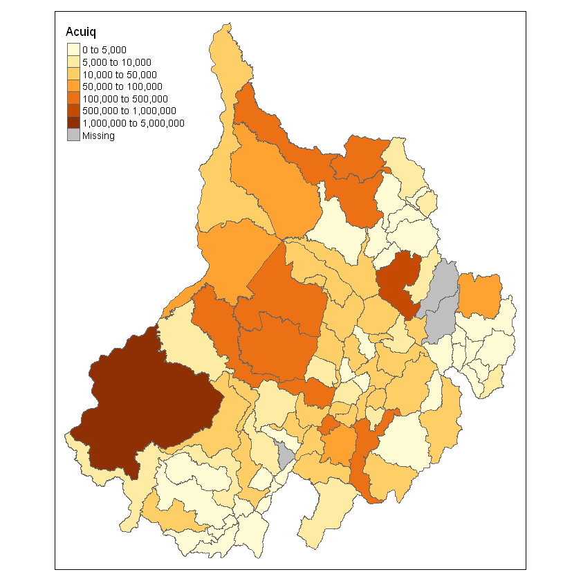

# Introducción al Análisis de Datos Espaciales usando R

Existen muchas herramientas para el análisis de datos espaciales, muchas de ellas intuitivas y diseñadas para la ubicación de puntos en un mapa y el cálculo de algunos resúmenes estadísticos y la identificación de clústeres basados en la autocorrelación espacial (son los llamados modelos LISA), usando paquetes como ArcGIS o QGIS (el primero con un costo alrededor de los U\$ 6.000 o U\$ 7.000, el segundo gratuito.

Como se ha discutio, **R** es un software gratuito que permite incorporar análisis espacial en múltiples niveles y analizar, no sólo modelos de autocorrelación espacial, también modelos de interdependencia espacial.

## Carga de Paquetes para Análisis Espacial

Los paquetes más comunes son:


```R
library(maps)         ## Para hacer proyecciones
library(maptools)     ## Para Gestionar Datos
library(sp)           ## Para Gestionar Datos
library(spdep)        ## Para al análisis de la Autocorrelación Espacial
library(gstat)        ## Para el uso de Elementos de Geoestadística
library(splancs)      ## Para el análisis de Kernel
library(spatstat)     ## Para el uso de Elementos de Geoestadística
library(pgirmess)     ## Para al análisis de la Autocorrelación Espacial
library(RColorBrewer) ## Provee Elementos de Visualización
library(classInt)     ## Permite la contrucción fácil de Intervalos de Clase
library(spgwr)        ## Provee ejemplos de modelamiento
```

    Loading required package: sp
    Checking rgeos availability: TRUE
    Loading required package: Matrix
    
    Spatial Point Pattern Analysis Code in S-Plus
     
     Version 2 - Spatial and Space-Time analysis
    
    Loading required package: nlme
    Loading required package: rpart
    
    spatstat 1.52-1       (nickname: 'Apophenia') 
    For an introduction to spatstat, type 'beginner' 
    
    
    Note: spatstat version 1.52-1 is out of date by more than 6 months; we recommend upgrading to the latest version.
    
    Attaching package: 'spatstat'
    
    The following object is masked from 'package:gstat':
    
        idw
    
    NOTE: This package does not constitute approval of GWR
    as a method of spatial analysis; see example(gwr)
    

## Visualizar algunos datos

Vamos a cargar algunos datos para ver su estructura:


```R
load("Datasets.RData")
ls()
```


<ol class=list-inline>
	<li>'crime'</li>
	<li>'dat88'</li>
	<li>'election'</li>
	<li>'laos'</li>
	<li>'mat88'</li>
	<li>'volcano'</li>
</ol>


Veamos de qué se trata la base 'crime':


```R
head(crime)
```


<table>
<thead><tr><th scope=col>ID</th><th scope=col>LONG</th><th scope=col>LAT</th></tr></thead>
<tbody>
	<tr><td>1        </td><td>-76.65159</td><td>39.23941 </td></tr>
	<tr><td>2        </td><td>-76.47434</td><td>39.35274 </td></tr>
	<tr><td>3        </td><td>-76.51726</td><td>39.25874 </td></tr>
	<tr><td>4        </td><td>-76.52607</td><td>39.40707 </td></tr>
	<tr><td>5        </td><td>-76.51001</td><td>39.33571 </td></tr>
	<tr><td>6        </td><td>-76.70375</td><td>39.26605 </td></tr>
</tbody>
</table>


Veamos, ahora, cuál es la dimensión del 'data.frame':


```R
dim(crime); data<-crime
```


<ol class=list-inline>
	<li>1061</li>
	<li>3</li>
</ol>


Vamos, ahora, a crear una matriz de coordenadas. Para ello empleamos la orden _cbind()_. Veamos de qué consta:


```R
help(cbind)
```


```R
sp_point <- cbind(data$LONG, data$LAT) # Construimos la matriz
colnames(sp_point) <- c("LONG","LAT") # Le damos nombre a las columnas de la matriz
head(sp_point)
```


<table>
<thead><tr><th scope=col>LONG</th><th scope=col>LAT</th></tr></thead>
<tbody>
	<tr><td>-76.65159</td><td>39.23941 </td></tr>
	<tr><td>-76.47434</td><td>39.35274 </td></tr>
	<tr><td>-76.51726</td><td>39.25874 </td></tr>
	<tr><td>-76.52607</td><td>39.40707 </td></tr>
	<tr><td>-76.51001</td><td>39.33571 </td></tr>
	<tr><td>-76.70375</td><td>39.26605 </td></tr>
</tbody>
</table>


El paso siguiente, al menos para el ejercicio, es asociar las coordenadas a un sistema de proyección geográfica. Para lo cual usamos la orden _CRS()_. Veamos de qué se trata:


```R
help(CRS)
```

Ahora, creamos el sistema de proyección:


```R
proj <- CRS("+proj=utm +zone=17 +datum=WGS84") # veamos las zonas en: http://www.dmap.co.uk/utmworld.htm
```

Con los elementos creados hasta el momento podemos crear el objeto espacial. En este caso, se trata de un marco de puntos espaciales _(Spatial Points Data Frame)_. Para ello usamos la orden _SpatialPointsDataFrame()_. Veamos de qué se trata:


```R
help(SpatialPointsDataFrame)
```

Creamos el objeto espacial:


```R
data.sp <- SpatialPointsDataFrame(coords=sp_point,data,proj4string=proj)
```

Ahora, requerimos delimitar el espacio de proyección (algo similar a hacer _zoom_ en un mapa de google). Con la orden _bbox()_ determinamos los límites de coordenadas:


```R
bbox(data.sp) # Esto será de suma importancia cuando se quiera hacer la proyección sobre un mapa
```


<table>
<thead><tr><th></th><th scope=col>min</th><th scope=col>max</th></tr></thead>
<tbody>
	<tr><th scope=row>LONG</th><td>-76.82981</td><td>-76.38756</td></tr>
	<tr><th scope=row>LAT</th><td> 39.22488</td><td> 39.67995</td></tr>
</tbody>
</table>


El siguiente paso es graficar los datos:


```R
par(mar=c(2,2,0.2,0.2))
plot(data.sp,pch=16, cex=.5, axes=T)
```


Co el fin de construir fácilmente los objetos espaciales, vamos a emplear la base de datos sobre elecciones presidenciales _"election"_ y aprovechamos sus atributos espaciales:


```R
summary(election)
```


    Object of class SpatialPolygonsDataFrame
    Coordinates:
              min       max
    r1 -124.73142 -66.96985
    r2   24.95597  49.37173
    Is projected: TRUE 
    proj4string :
    [+proj=lcc+lon_0=90w +lat_1=20n +lat_2=60n]
    Data attributes:
             NAME         STATE_NAME     STATE_FIPS     CNTY_FIPS         FIPS     
     Washington:  32   Texas   : 254   48     : 254   001    :  48   01001  :   1  
     Jefferson :  26   Georgia : 159   13     : 159   003    :  48   01003  :   1  
     Franklin  :  25   Virginia: 136   51     : 136   005    :  48   01005  :   1  
     Jackson   :  24   Kentucky: 120   21     : 120   009    :  47   01007  :   1  
     Lincoln   :  24   Missouri: 115   29     : 115   007    :  46   01009  :   1  
     Madison   :  20   Kansas  : 105   20     : 105   011    :  46   01011  :   1  
     (Other)   :2960   (Other) :2222   (Other):2222   (Other):2828   (Other):3105  
          AREA              FIPS_num          Bush            Kerry        
     Min.   :    1.731   Min.   : 1001   Min.   :     0   Min.   :      0  
     1st Qu.:  435.218   1st Qu.:19048   1st Qu.:  2926   1st Qu.:   1778  
     Median :  622.319   Median :29217   Median :  6357   Median :   4041  
     Mean   :  965.434   Mean   :30699   Mean   : 19055   Mean   :  17940  
     3rd Qu.:  930.802   3rd Qu.:46012   3rd Qu.: 15894   3rd Qu.:  10418  
     Max.   :20174.584   Max.   :56045   Max.   :954764   Max.   :1670341  
                                                                           
        County_F         Nader             Total            Bush_pct    
     Min.   :    0   Min.   :    0.0   Min.   :      0   Min.   : 0.00  
     1st Qu.:19042   1st Qu.:    0.0   1st Qu.:   4808   1st Qu.:52.72  
     Median :29211   Median :   14.0   Median :  10407   Median :61.17  
     Mean   :30656   Mean   :  145.3   Mean   :  37140   Mean   :60.60  
     3rd Qu.:46008   3rd Qu.:   67.0   3rd Qu.:  26553   3rd Qu.:69.36  
     Max.   :56045   Max.   :13251.0   Max.   :2625105   Max.   :92.83  
                                                                        
       Kerry_pct       Nader_pct         MDratio             hosp       
     Min.   : 0.00   Min.   :0.0000   Min.   :   0.00   Min.   : 0.000  
     1st Qu.:30.21   1st Qu.:0.0000   1st Qu.:  37.28   1st Qu.: 1.305  
     Median :38.47   Median :0.3024   Median :  65.58   Median : 3.290  
     Mean   :38.90   Mean   :0.4009   Mean   :  93.03   Mean   : 5.670  
     3rd Qu.:46.78   3rd Qu.:0.6332   3rd Qu.: 117.50   3rd Qu.: 6.740  
     Max.   :90.05   Max.   :4.4667   Max.   :2189.54   Max.   :84.070  
                                                                        
        pcthisp          pcturban         urbrural        pctfemhh    
     Min.   :  0.00   Min.   :  0.00   Min.   :0.000   Min.   : 0.00  
     1st Qu.:  4.00   1st Qu.:  0.00   1st Qu.:3.000   1st Qu.: 9.60  
     Median :  8.00   Median : 33.40   Median :6.000   Median :12.20  
     Mean   : 44.46   Mean   : 35.29   Mean   :5.537   Mean   :12.99  
     3rd Qu.: 24.00   3rd Qu.: 56.45   3rd Qu.:7.000   3rd Qu.:15.40  
     Max.   :972.00   Max.   :100.00   Max.   :9.000   Max.   :41.10  
                                                                      
        pcincome        pctpoor         pctlt9ed       pcthsed      
     Min.   :    0   Min.   : 0.00   Min.   : 0.0   Min.   :  0.00  
     1st Qu.:15466   1st Qu.:11.00   1st Qu.: 8.9   1st Qu.: 61.10  
     Median :17448   Median :15.10   Median :13.2   Median : 71.20  
     Mean   :17788   Mean   :16.49   Mean   :14.3   Mean   : 68.34  
     3rd Qu.:19818   3rd Qu.:20.40   3rd Qu.:18.7   3rd Qu.: 77.10  
     Max.   :58096   Max.   :63.10   Max.   :56.3   Max.   :100.00  
                                                                    
        pctcoled        unemploy         pctwhtcl        homevalu     
     Min.   : 0.00   Min.   : 0.000   Min.   : 0.00   Min.   :     0  
     1st Qu.: 9.00   1st Qu.: 3.900   1st Qu.:38.45   1st Qu.: 35850  
     Median :11.60   Median : 5.300   Median :43.50   Median : 44400  
     Mean   :13.13   Mean   : 5.869   Mean   :44.54   Mean   : 52016  
     3rd Qu.:15.30   3rd Qu.: 7.200   3rd Qu.:50.70   3rd Qu.: 58600  
     Max.   :53.40   Max.   :37.900   Max.   :81.40   Max.   :500001  
                                                                      
          rent          popdens            crowded          ginirev      
     Min.   :  0.0   Min.   :    0.00   Min.   : 0.000   Min.   :0.0000  
     1st Qu.:255.0   1st Qu.:   15.40   1st Qu.: 1.800   1st Qu.:0.3900  
     Median :297.0   Median :   38.60   Median : 2.600   Median :0.4200  
     Mean   :313.3   Mean   :  193.77   Mean   : 3.607   Mean   :0.4135  
     3rd Qu.:352.0   3rd Qu.:   93.15   3rd Qu.: 4.500   3rd Qu.:0.4400  
     Max.   :926.0   Max.   :53801.10   Max.   :44.400   Max.   :0.5800  
                                                                         
       SmokecurM         SmokevrM       SmokecurF         SmokevrF     
     Min.   :0.0000   Min.   :0.000   Min.   :0.0000   Min.   :0.0000  
     1st Qu.:0.2200   1st Qu.:0.490   1st Qu.:0.1900   1st Qu.:0.3900  
     Median :0.2400   Median :0.520   Median :0.2100   Median :0.4200  
     Mean   :0.2415   Mean   :0.505   Mean   :0.2085   Mean   :0.4122  
     3rd Qu.:0.2700   3rd Qu.:0.540   3rd Qu.:0.2400   3rd Qu.:0.4600  
     Max.   :0.5800   Max.   :0.780   Max.   :0.4200   Max.   :0.6300  
                                                                       
         Obese            Noins          XYLENES__M          TOLUENE        
     Min.   :0.0000   Min.   :0.0000   Min.   :    0.00   Min.   :    0.00  
     1st Qu.:0.3200   1st Qu.:0.1000   1st Qu.:   26.80   1st Qu.:   44.34  
     Median :0.3400   Median :0.1200   Median :   57.98   Median :   91.07  
     Mean   :0.3345   Mean   :0.1293   Mean   :  222.20   Mean   :  335.63  
     3rd Qu.:0.3600   3rd Qu.:0.1500   3rd Qu.:  169.79   3rd Qu.:  255.01  
     Max.   :0.6300   Max.   :0.4100   Max.   :16661.05   Max.   :28305.10  
                                                                            
       TETRACHLOR          STYRENE           NICKEL_COM         METHYLENE_     
     Min.   :   0.000   Min.   :   0.000   Min.   : 0.00000   Min.   :   0.00  
     1st Qu.:   0.740   1st Qu.:   0.840   1st Qu.: 0.00485   1st Qu.:   1.55  
     Median :   1.860   Median :   1.850   Median : 0.01000   Median :   3.88  
     Mean   :  13.724   Mean   :  15.422   Mean   : 0.37084   Mean   :  26.40  
     3rd Qu.:   6.625   3rd Qu.:   8.085   3rd Qu.: 0.11000   3rd Qu.:  12.47  
     Max.   :1966.560   Max.   :1413.040   Max.   :69.01000   Max.   :2764.20  
                                                                               
       MERCURY_CO        LEAD_COMPO          BENZENE__I        ARSENIC_CO      
     Min.   :0.00000   Min.   :  0.00000   Min.   :   0.00   Min.   : 0.00000  
     1st Qu.:0.00153   1st Qu.:  0.00608   1st Qu.:  22.45   1st Qu.: 0.00034  
     Median :0.00430   Median :  0.02000   Median :  41.81   Median : 0.00166  
     Mean   :0.05739   Mean   :  0.82285   Mean   : 105.49   Mean   : 0.11253  
     3rd Qu.:0.02000   3rd Qu.:  0.23000   3rd Qu.:  96.44   3rd Qu.: 0.01500  
     Max.   :3.22000   Max.   :290.63000   Max.   :4612.35   Max.   :32.47000  
                                                                               
        POP2000          POP00SQMIL          MALE2000         FEMALE2000     
     Min.   :      0   Min.   :    0.00   Min.   :      0   Min.   :      0  
     1st Qu.:  11343   1st Qu.:   17.45   1st Qu.:   5583   1st Qu.:   5598  
     Median :  24747   Median :   43.10   Median :  12272   Median :  12512  
     Mean   :  89145   Mean   :  244.36   Mean   :  43726   Mean   :  45419  
     3rd Qu.:  61896   3rd Qu.:  104.95   3rd Qu.:  30370   3rd Qu.:  31548  
     Max.   :9519338   Max.   :66934.30   Max.   :4704105   Max.   :4815233  
                                                                             
        MAL2FEM          UNDER18           AIAN            ASIA      
     Min.   :  0.00   Min.   : 0.00   Min.   : 0.00   Min.   : 0.00  
     1st Qu.: 94.00   1st Qu.:23.70   1st Qu.: 0.20   1st Qu.: 0.20  
     Median : 97.00   Median :25.30   Median : 0.30   Median : 0.30  
     Mean   : 98.34   Mean   :25.47   Mean   : 1.61   Mean   : 0.77  
     3rd Qu.:100.00   3rd Qu.:27.10   3rd Qu.: 0.80   3rd Qu.: 0.70  
     Max.   :205.00   Max.   :45.30   Max.   :94.20   Max.   :30.80  
                                                                     
         BLACK             NHPI             WHITE         AIAN_MORE     
     Min.   : 0.000   Min.   :0.00000   Min.   : 0.00   Min.   : 0.000  
     1st Qu.: 0.300   1st Qu.:0.00000   1st Qu.:77.10   1st Qu.: 0.500  
     Median : 1.700   Median :0.00000   Median :91.30   Median : 0.800  
     Mean   : 8.832   Mean   :0.03603   Mean   :84.69   Mean   : 2.223  
     3rd Qu.:10.100   3rd Qu.:0.10000   3rd Qu.:96.70   3rd Qu.: 1.400  
     Max.   :86.500   Max.   :1.50000   Max.   :99.70   Max.   :95.100  
                                                                        
       ASIA_MORE          BLK_MORE        NHPI_MORE          WHT_MORE    
     Min.   : 0.0000   Min.   : 0.000   Min.   :0.00000   Min.   : 0.00  
     1st Qu.: 0.3000   1st Qu.: 0.400   1st Qu.:0.00000   1st Qu.:79.00  
     Median : 0.5000   Median : 2.100   Median :0.10000   Median :92.60  
     Mean   : 0.9749   Mean   : 9.128   Mean   :0.09952   Mean   :85.92  
     3rd Qu.: 0.9000   3rd Qu.:10.700   3rd Qu.:0.10000   3rd Qu.:97.60  
     Max.   :32.6000   Max.   :86.700   Max.   :2.60000   Max.   :99.90  
                                                                         
        HISP_LAT        CH19902000       MEDAGE2000      PEROVER65   
     Min.   : 0.000   Min.   :-37.40   Min.   : 0.00   Min.   : 0.0  
     1st Qu.: 0.900   1st Qu.:  1.00   1st Qu.:35.20   1st Qu.:12.1  
     Median : 1.800   Median :  8.40   Median :37.40   Median :14.4  
     Mean   : 6.183   Mean   : 11.08   Mean   :37.34   Mean   :14.8  
     3rd Qu.: 5.100   3rd Qu.: 17.40   3rd Qu.:39.80   3rd Qu.:17.1  
     Max.   :97.500   Max.   :191.00   Max.   :54.30   Max.   :34.7  
                                                                     


```R
names(election)
```


<ol class=list-inline>
	<li>'NAME'</li>
	<li>'STATE_NAME'</li>
	<li>'STATE_FIPS'</li>
	<li>'CNTY_FIPS'</li>
	<li>'FIPS'</li>
	<li>'AREA'</li>
	<li>'FIPS_num'</li>
	<li>'Bush'</li>
	<li>'Kerry'</li>
	<li>'County_F'</li>
	<li>'Nader'</li>
	<li>'Total'</li>
	<li>'Bush_pct'</li>
	<li>'Kerry_pct'</li>
	<li>'Nader_pct'</li>
	<li>'MDratio'</li>
	<li>'hosp'</li>
	<li>'pcthisp'</li>
	<li>'pcturban'</li>
	<li>'urbrural'</li>
	<li>'pctfemhh'</li>
	<li>'pcincome'</li>
	<li>'pctpoor'</li>
	<li>'pctlt9ed'</li>
	<li>'pcthsed'</li>
	<li>'pctcoled'</li>
	<li>'unemploy'</li>
	<li>'pctwhtcl'</li>
	<li>'homevalu'</li>
	<li>'rent'</li>
	<li>'popdens'</li>
	<li>'crowded'</li>
	<li>'ginirev'</li>
	<li>'SmokecurM'</li>
	<li>'SmokevrM'</li>
	<li>'SmokecurF'</li>
	<li>'SmokevrF'</li>
	<li>'Obese'</li>
	<li>'Noins'</li>
	<li>'XYLENES__M'</li>
	<li>'TOLUENE'</li>
	<li>'TETRACHLOR'</li>
	<li>'STYRENE'</li>
	<li>'NICKEL_COM'</li>
	<li>'METHYLENE_'</li>
	<li>'MERCURY_CO'</li>
	<li>'LEAD_COMPO'</li>
	<li>'BENZENE__I'</li>
	<li>'ARSENIC_CO'</li>
	<li>'POP2000'</li>
	<li>'POP00SQMIL'</li>
	<li>'MALE2000'</li>
	<li>'FEMALE2000'</li>
	<li>'MAL2FEM'</li>
	<li>'UNDER18'</li>
	<li>'AIAN'</li>
	<li>'ASIA'</li>
	<li>'BLACK'</li>
	<li>'NHPI'</li>
	<li>'WHITE'</li>
	<li>'AIAN_MORE'</li>
	<li>'ASIA_MORE'</li>
	<li>'BLK_MORE'</li>
	<li>'NHPI_MORE'</li>
	<li>'WHT_MORE'</li>
	<li>'HISP_LAT'</li>
	<li>'CH19902000'</li>
	<li>'MEDAGE2000'</li>
	<li>'PEROVER65'</li>
</ol>


Con el fin de editar los datos (si es necesario), creamos una nueva base de datos con la información electoral:


```R
data <- election
```

Ahora extraemos la información espacial:


```R
summary(data)[1:4]
```


<dl>
	<dt>$class</dt>
		<dd>'SpatialPolygonsDataFrame'</dd>
	<dt>$bbox</dt>
		<dd><table>
<thead><tr><th></th><th scope=col>min</th><th scope=col>max</th></tr></thead>
<tbody>
	<tr><th scope=row>r1</th><td>-124.73142</td><td>-66.96985 </td></tr>
	<tr><th scope=row>r2</th><td>  24.95597</td><td> 49.37173 </td></tr>
</tbody>
</table>
</dd>
	<dt>$is.projected</dt>
		<dd>TRUE</dd>
	<dt>$proj4string</dt>
		<dd>'+proj=lcc+lon_0=90w +lat_1=20n +lat_2=60n'</dd>
</dl>


Veamos de qué se trata el gráfico:


```R
par(mar=c(0,0,0,0))
plot(data)
```


Ahora, incorporemos los datos de criminalidad a la base de datos geográfica (el mapa):


```R
par(mar=rep(0.5,4))
plot(election,xlim=bbox(data.sp)[1,],ylim=bbox(data.sp)[2,],col="beige")
plot(data.sp,pch=19, cex=.5,add=T, col="blue")
```


## Otra forma de visualización de datos

Necesitamos cargar algunas librerías que ayudarán al a visualización. _¿Qué librerías se usan acá que también se usaron en el ejercicio anterior?_


```R
library("sp")
library("raster")
library("rasterVis")
library("maptools")
library("rgdal")
library("gstat")
library("maps")
library("mapdata")
library("mapproj")
library("ggmap")
library("ggplot2")
library("lattice")
library("latticeExtra")
#library("OpenStreetMap") sobre la carga de este paquete se discutirá más adelante
```

**NOTA**: En caso que las librerías no se encuentren instaladas debe procederse a la instalación cambiando, en el fragmento de código anterior, la expresión library por _install.packages()_. Luego de instaladas se ejecuta el código anterior.

### Configuración del espacio de trabajo

En primer lugar, debemos definir el entorno de trabajo para lo cual se crean algunos objetos:


```R
myTheme <- custom.theme.2(pch=19, cex=0.7,
                            region=rev(brewer.pal(9, 'YlOrRd')),
                            symbol = brewer.pal(n=8, name = "Dark2"))
myTheme$strip.background$col='transparent'
  myTheme$strip.shingle$col='transparent'
  myTheme$strip.border$col='transparent'
  
  xscale.components.custom <- function(...){
      ans <- xscale.components.default(...)
      ans$top=FALSE
      ans}
  yscale.components.custom <- function(...){
      ans <- yscale.components.default(...)
      ans$right=FALSE
      ans}
  myArgs <- list(as.table=TRUE,
                 between=list(x=0.5, y=0.2),
                 xscale.components = xscale.components.custom,
                 yscale.components = yscale.components.custom)
  defaultArgs <- lattice.options()$default.args
  
  lattice.options(default.theme = myTheme,
                  default.args = modifyList(defaultArgs, myArgs))
```

Ahora, carguemos los objetos que vamos a visualizar:


```R
load("NO2sp.Rdata")  # Cargamos los objetos
ls()                 # Listamos los objetos creados hasta el momento
class(NO2sp)         # Identificamos el tipo de objeto
str(NO2sp)           # Revismos la Estructura del Objeto Espacial
```


<ol class=list-inline>
	<li>'crime'</li>
	<li>'dat88'</li>
	<li>'data'</li>
	<li>'data.sp'</li>
	<li>'defaultArgs'</li>
	<li>'election'</li>
	<li>'laos'</li>
	<li>'mat88'</li>
	<li>'myArgs'</li>
	<li>'myTheme'</li>
	<li>'NO2sp'</li>
	<li>'proj'</li>
	<li>'sp_point'</li>
	<li>'volcano'</li>
	<li>'xscale.components.custom'</li>
	<li>'yscale.components.custom'</li>
</ol>


'SpatialPointsDataFrame'


    Formal class 'SpatialPointsDataFrame' [package "sp"] with 5 slots
      ..@ data       :'data.frame':	24 obs. of  6 variables:
      .. ..$ Nombre: Factor w/ 24 levels "Arturo Soria",..: 17 16 4 10 7 2 23 1 24 6 ...
      .. ..$ alt   : int [1:24] 657 637 673 672 699 708 677 698 NA 581 ...
      .. ..$ codEst: num [1:24] 28079035 28079004 28079039 28079008 28079038 ...
      .. ..$ mean  : num [1:24] 51 50.6 49.3 59.6 54.6 53.6 44.2 44.1 45.8 40 ...
      .. ..$ median: num [1:24] 46 49 43 58 51 51 41 41 38 37 ...
      .. ..$ sd    : num [1:24] 18.6 18.3 24.2 17.7 22.7 21.8 20 19.2 24.9 19.8 ...
      ..@ coords.nrs : num(0) 
      ..@ coords     : num [1:24, 1:2] -3.7 -3.71 -3.71 -3.68 -3.71 ...
      .. ..- attr(*, "dimnames")=List of 2
      .. .. ..$ : NULL
      .. .. ..$ : chr [1:2] "long" "lat"
      ..@ bbox       : num [1:2, 1:2] -3.77 40.33 -3.58 40.52
      .. ..- attr(*, "dimnames")=List of 2
      .. .. ..$ : chr [1:2] "long" "lat"
      .. .. ..$ : chr [1:2] "min" "max"
      ..@ proj4string:Formal class 'CRS' [package "sp"] with 1 slot
      .. .. ..@ projargs: chr "+proj=longlat +ellps=WGS84 +datum=WGS84 +towgs84=0,0,0"
    

Grafiquemos haciendo uso de las funciones en la librería _"sp"_:


```R
library("sp")
airPal <- colorRampPalette(c("springgreen1", "sienna3", "gray5"))(5)

spplot(NO2sp["mean"],col.regions=airPal, cex=sqrt(1:5),
edge.col="black",scales=list(draw=TRUE),
key.space="right")
```


Usemos otra opción asociada a la librería _"ggplot2"_:


```R
library("ggplot2")
NO2df<-data.frame(NO2sp)      # Convertimos el objeto espacial en base de datos plana
NO2df$Mean<-cut(NO2sp$mean,5) # Intervalos para la media

ggplot(data=NO2df, aes(long, lat, size=Mean, fill=Mean)) +
geom_point(pch=21, col="black") + theme_bw() +
scale_fill_manual(values=airPal)
```

    Warning message:
    "Using size for a discrete variable is not advised."


Podemos optimizar la clasificación construyendo intervalos de clase usando funciones de la librería _"classInt"_:


```R
library(classInt)
nClasses <- 5
intervals <- classIntervals(NO2sp$mean, n=nClasses, style="fisher")
nClasses <- length(intervals$brks) - 1
op <- options(digits=4)
tab <- print(intervals)
options(op)

dent <- c(0.64, 1.14, 1.65, 2.79, 4.32, 6.22, 9.65, 12.95, 15.11)
dentAQ <- dent[seq_len(nClasses)]
idx <- findCols(intervals)
cexNO2 <- dentAQ[idx]

NO2sp$classNO2 <- factor(names(tab)[idx])


NO2df <- data.frame(NO2sp)

ggplot(data=NO2df, aes(long, lat, size=classNO2, fill=classNO2)) +
geom_point(pch=21, col="black") + theme_bw() +
scale_fill_manual(values=airPal) +
scale_size_manual(values=dentAQ*2)
```

    style: fisher
      one of 7,315 possible partitions of this variable into 5 classes
        [22.5,33)    [33,42.05) [42.05,48.95)  [48.95,57.1)   [57.1,62.4] 
                3             6             7             6             2 
    


La librería _"spplot"_ ofrece otra opción de visualización:


```R
NO2key <- list(x=0.98, y=0.02, corner=c(1, 0),
title=expression(NO[2]~~(paste(mu, plain(g))/m^3)),
cex.title=.75, cex=0.7,
background="gray92")

pNO2 <- spplot(NO2sp["classNO2"],
col.regions=airPal, cex=dentAQ,
edge.col="black",
scales=list(draw=TRUE),
key.space=NO2key)
pNO2

madridBox <- bbox(NO2sp)
```


Finalmente, podemos usar opciones de la librería _"ggmap"_:


```R
library(ggmap)
madridGG <- get_map(c(madridBox), maptype="toner", source="stamen")
```

    Map from URL : http://tile.stamen.com/toner/12/2005/1542.png
    Map from URL : http://tile.stamen.com/toner/12/2006/1542.png
    Map from URL : http://tile.stamen.com/toner/12/2007/1542.png
    Map from URL : http://tile.stamen.com/toner/12/2005/1543.png
    Map from URL : http://tile.stamen.com/toner/12/2006/1543.png
    Map from URL : http://tile.stamen.com/toner/12/2007/1543.png
    Map from URL : http://tile.stamen.com/toner/12/2005/1544.png
    Map from URL : http://tile.stamen.com/toner/12/2006/1544.png
    Map from URL : http://tile.stamen.com/toner/12/2007/1544.png
    Map from URL : http://tile.stamen.com/toner/12/2005/1545.png
    Map from URL : http://tile.stamen.com/toner/12/2006/1545.png
    Map from URL : http://tile.stamen.com/toner/12/2007/1545.png
    


```R
ggmap(madridGG) +
geom_point(data=NO2df,
aes(long, lat, size=classNO2, fill=classNO2),
pch=21, col="black") +
scale_fill_manual(values=airPal) +
scale_size_manual(values=dentAQ*2)
```




